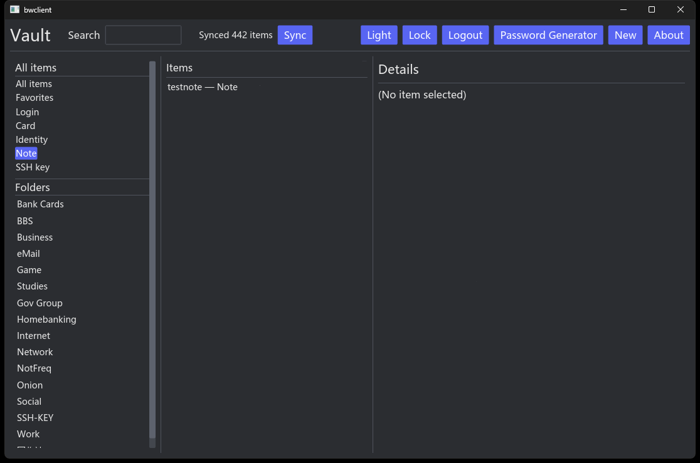
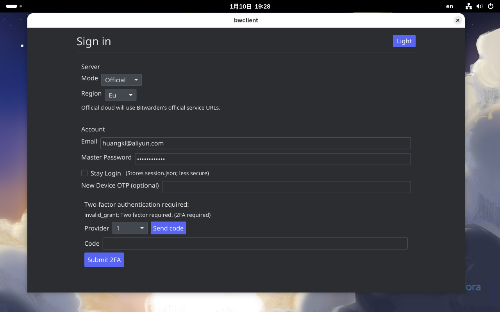

# bwclient

BwClient 是一个基于 Rust + `iced` 的桌面端 Bitwarden 客户端，覆盖登录认证、保险库同步、本地解密展示、TOTP、密码生成与会话持久化等核心能力，支持连接自建 Bitwarden 服务端，也支持 Bitwarden 官方云。

## 一、项目简介

BwClientV1.0 面向需要桌面端保险库管理能力的场景，提供三栏式保险库管理界面、常见条目编辑与查看能力，以及适用于日常使用的密码生成器与主题切换能力。

## 界面预览

### Windows



### Linux



## 二、用途

### 2.1 功能介绍

BwClientV1.0 提供如下核心用途：

1. 安全登录与密钥派生：通过 Bitwarden 协议的预登录（Prelogin）获取 KDF 参数，基于主密码进行密钥派生与服务端认证，完成令牌获取。
2. 保险库同步与本地解密展示：调用服务端同步接口拉取保险库数据，在本地进行解密与结构化展示。
3. 三栏式保险库管理：采用“左侧分类/文件夹 + 中间列表 + 右侧详情”的布局，提升条目查找与操作效率。
4. 条目常用操作：支持创建、编辑、删除、复制字段、显示/隐藏敏感字段等常用动作。
5. 密码生成器：内置可配置的密码生成器，并在登录条目编辑中提供一键生成能力。
6. 会话与偏好持久化：提供主题设置与会话持久化（便于下次启动恢复），并支持退出登录/锁定清理。

说明：BwClientV1.0 优先支持自建/私有化服务端，但同时也支持连接 Bitwarden 官方云（Official 模式）。

- 登录界面现在支持 Custom（自建）与 Official（官方云，Com/Eu）两种模式，默认使用 Custom。官方云可通过区域下拉选择（Com / Eu）。
- 为提高与官方云的兼容性，当选择 Official 模式时客户端会尽力仿真浏览器行为：提交 `client_id=web`、`deviceType=9`、`deviceName=chrome`、使用浏览器风格的 `User-Agent`，并在必要时附带 `Origin/Referer`，以减少被识别为 Unknown Browser 的概率。

### 2.2 功能清单

以下清单按照用户可感知功能进行拆分，便于验收、培训与编写配套截图。

#### 2.2.1 登录与服务器配置

- 自建服务器 Base URL 输入（客户端自动派生 `/identity` 与 `/api` 服务地址）
- 服务器模式切换：Custom（自建）/ Official（官方云，Com/Eu）（默认 Custom）；Official 下会启用浏览器仿真以提高兼容性。
- 账号登录：Email + Master Password（在 Official 模式下客户端会模拟浏览器请求细节以匹配官方云的行为）
- 两步验证（2FA）支持：
  - Email 2FA（provider id 1 显示为 Email）：当服务端要求 2FA 时，界面会显示 provider 并提供 Send code（触发 `/api/two-factor/send-email-login`）按钮；收到邮件验证码后，在 UI 的 Code 字段粘贴并点击 Submit 2FA。客户端会同时提交 `twoFactorToken`（浏览器常用字段）及 `twoFactorCode`，并支持 `twoFactorRemember`（记住设备）字段以匹配官方行为。
  - New Device OTP：仍可在登录表单中填写 New Device OTP（若服务端要求此项）。
- 登录状态提示：进行中/成功/失败原因

> 截图占位：登录界面

#### 2.2.2 会话管理（退出/锁定/恢复）

- 退出登录（Logout）：清理本地会话文件并返回登录页
- 锁定（Lock）：仅清理内存会话并返回登录页（不删除会话文件）
- 启动自动恢复：检测到已保存会话时，启动后直接进入保险库界面

> 截图占位：顶部工具栏 - Logout/Lock

#### 2.2.3 同步（Sync）

- 自动同步：进入保险库界面后自动触发同步
- 手动同步：工具栏 Sync 按钮触发重新同步
- 同步状态提示：Idle / Syncing / Done（显示已同步条目数量）/ Error

> 截图占位：同步状态与 Sync 按钮

#### 2.2.4 主题与外观

- 主题切换：Light / Dark
- 主题持久化：下次启动沿用上次主题

> 截图占位：主题切换按钮

#### 2.2.5 保险库浏览（左侧栏）

- 预置筛选：All items / Favorites
- 类型筛选：Login / Card / Identity / Note / SSH key
- 文件夹浏览：从服务端同步文件夹列表并可按文件夹过滤

> 截图占位：左侧栏 - 类型与文件夹

#### 2.2.6 搜索与列表（中间栏）

- 搜索框：支持按“名称 + 用户名”进行模糊匹配
- 列表展示：
  - Login：显示 Name — Username
  - 非 Login：显示 Name — Type
- 点击选择条目后，右侧展示详情

> 截图占位：搜索框与条目列表

#### 2.2.7 条目详情查看（右侧栏 / View）

- 查看条目基础信息：名称、类型、收藏、文件夹（如有）
- 字段复制：常见字段提供 Copy 按钮（例如用户名/卡号/SSH key 等）
- 敏感字段显示/隐藏：例如密码、SSH 私钥支持 Show/Hide
- 双因素验证码（TOTP）：在 Login 条目中可显示当前验证码，并显示失效倒计时；支持一键复制
- 备注显示：Notes 字段支持阅读

> 截图占位：条目详情 - 查看模式

#### 2.2.8 条目新增与编辑（右侧栏 / Edit）

- 新建条目：顶部 New 按钮
- 编辑条目：详情页 Edit 按钮
- 保存（Save）/ 取消（Cancel）
- 删除（Delete... → Confirm delete?）
- 新建条目支持选择类型：Login / Note / Card / Identity / SSH key
- Login 条目支持编辑/粘贴 TOTP（两步验证密钥），保存后加密写入服务端

> 截图占位：条目编辑 - 基础字段

#### 2.2.9 Login 条目（账号密码类）

- 字段：Username、Password、TOTP、URLs（多行）
- Password 显示/隐藏
- Password 复制（Copy）
- 一键生成密码（Gen）：使用默认密码生成器配置立即生成并写入 Password
- TOTP 显示（详情页）：
  - 实时显示当前验证码
  - 显示失效倒计时（例如“Expires in 12s”）
  - 一键复制当前验证码
- TOTP 编辑（编辑页）：支持直接粘贴以下任一种形式
  - Base32 secret（常见于手动密钥）
  - `otpauth://totp/...`（常见于二维码解析结果）

> 截图占位：Login 编辑 - Gen/Copy/Show/TOTP

> 截图占位：Login 详情 - TOTP 倒计时与 Copy

#### 2.2.10 Note 条目（安全笔记）

- 字段：Notes
- 查看与编辑

> 截图占位：Note 详情/编辑

#### 2.2.11 Card 条目（卡片信息）

- 字段：Cardholder、Brand、Number、Expiration、Security code
- 复制：Number、Security code 等支持复制（视界面按钮为准）

> 截图占位：Card 详情/编辑

#### 2.2.12 Identity 条目（身份信息）

- 固定两列布局（每行最多两个字段，不随窗口动态换行造成错位）
- 编辑界面不提供 Copy 按钮（降低误触与视觉噪声）
- 字段布局：
  - Title | First
  - Middle | Last
  - Company | User
  - Email
  - Phone
  - Address1
  - Address2 | Address3
  - City | State
  - Country | Postal
  - SSN
  - Passport | License

> 截图占位：Identity 详情/编辑（按固定布局）

#### 2.2.13 SSH key 条目（SSH 密钥）

- 字段：Fingerprint、Public key、Private key
- Public/Private 支持复制
- Private key 支持 Show/Hide

> 截图占位：SSH key 详情/编辑

#### 2.2.14 密码生成器（独立窗口）

- 独立入口：工具栏 Password Generator
- 生成结果：显示生成密码；支持 Copy 与 Regenerate
- 选项：
  - Length（默认 16）
  - Include：A-Z（默认开）、a-z（默认开）、0-9（默认开）、!@#$%^&*（默认关）
  - Minimum numbers（默认 3；当 0-9 未勾选时禁用并按 0 处理）
  - Minimum special（默认 3；当特殊字符未勾选时禁用并按 0 处理）
- 选项持久化：下次启动沿用上次配置

> 截图占位：密码生成器

## 三、当前实现情况

- GUI：基于 `iced` 实现桌面图形界面，主要界面逻辑位于 `src/iced_app.rs` 与 `src/iced_app/view.rs`
- 功能模块：已包含 `api`、`totp`、`password_generator`、`crypto` 等主要模块
- 平台支持：支持 Windows / macOS / Linux 编译与发布流程
- macOS：Release 工作流会生成 `.app` 与 `.dmg`

## 四、开发与本地构建

开发运行：

```bash
cargo run
```

本地 Release 构建：

```bash
cargo build --release
# 二进制输出位置：target/release/bwclient
# Linux/macOS: ./target/release/bwclient
# Windows: target\release\bwclient.exe
```

触发 GitHub Release：

```bash
git tag -a v0.1.0 -m "Release v0.1.0"
git push origin v0.1.0
```

更多发布说明请参考 `docs/releasing.md`。

## 五、macOS 双击运行说明

- Release 工作流会生成 `.app` 并打包为 `.dmg`，挂载后可直接双击 `bwclient.app` 启动。
- 如果本地打开时受到系统安全策略限制，可尝试执行 `sudo xattr -cr bwclient.app`。

## 六、参与贡献

欢迎提交 issue 或 PR。在提交前建议至少运行以下命令：

```bash
cargo fmt
cargo clippy
```